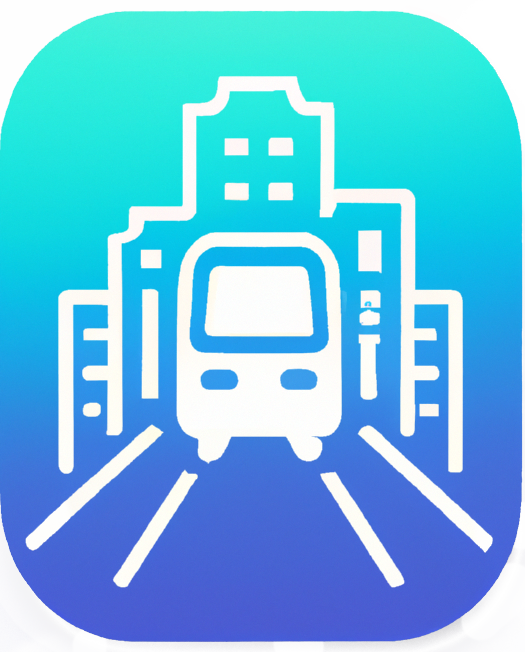
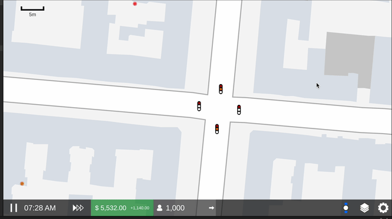
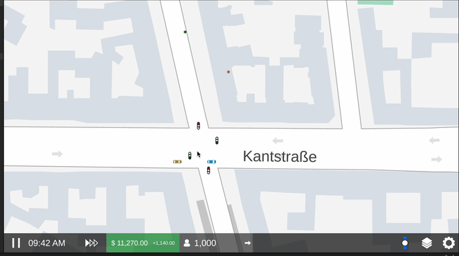

<h1>  Transidious</h1>

Transidious is a city-simulation game built with Unity. The player's objective is to optimize the city's public transportation system.

## Note

Transidious is an unfinished project. Many aspects of the simulation are working, but there is little to no gameplay, so it might be more fair to refer to this project as a traffic simulation rather than a game.

## Features

- Rendering of **real-world** areas using data imported from OpenStreetMap
- Car **traffic simulation** on real-world streets using the [Intelligent driver model](https://en.wikipedia.org/wiki/Intelligent_driver_model)
- **Agent-based simulation** for citizens with persistent homes, jobs, finances, and needs
- Simulation of a **public transportation network** including buses, trams, subways, light rail, and ferries with customizable vehicles and schedules
- **Multimodal pathfinding** for agents using A* search
- Simulation of time with **adjustable simulation speeds**

## Demos

- Imported map of Charlottenburg with basic navigation

- Traffic simulation at a simple intersection

- Traffic simulation at a complex intersection

- Agent simulation

